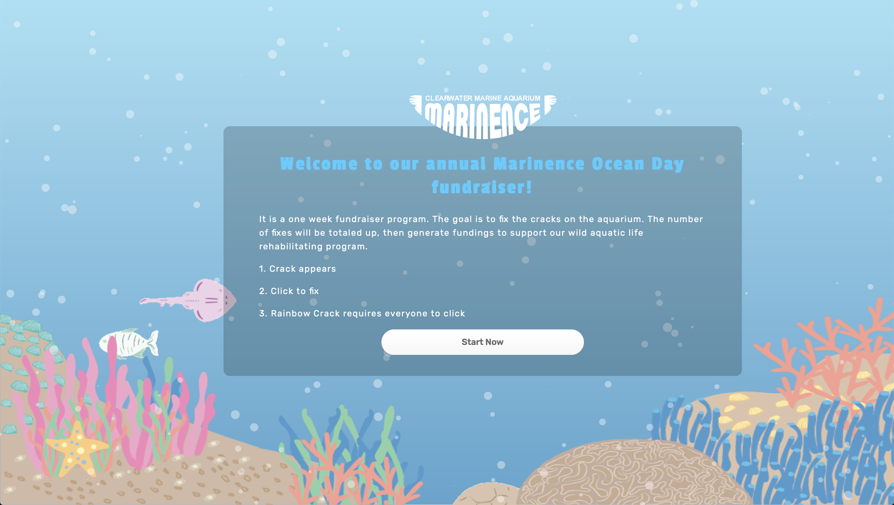
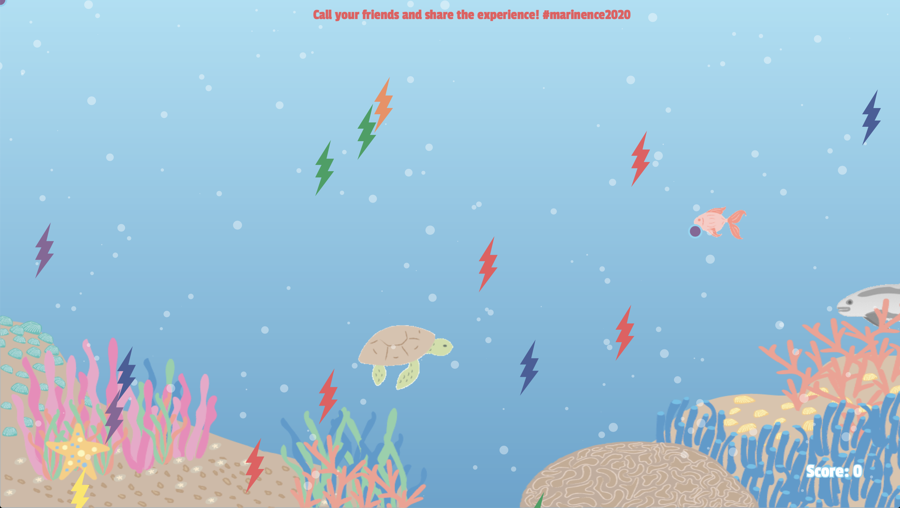

<h1> Marinence </h1> 

<h4> Bianca Dias Cheung, Cecilia Gaetarelli, Xushan Li </h4> 

<p> Creative Coding 2019/2020 - https://marinence.herokuapp.com 
<br>Politecnico di Milano - Scuola del Design 
<br>Faculty: Michele Mauri, Andrea Benedetti  </p> 





<h3> Project Idea </h3> 

Every day we hear about climate change and the enormous impact that it has on the ocean’s wildlife. Working together and with a small effort, we can all contribute to changing the conditions of our oceans.<br>
With this interactive web space people from all over the world can collaborate in doing it. Marinence is a web experience realized by the Clearwater Marine Aquarium, an hospital and rehab center for the endagered species in the ocean. 
Pretending that we could see the ocean like an aquarium the users have to cover with their cursor the cracks that appear on the screen in order to save the fishes. Each repaired crack represents one dollar donated from Clearwater to the protection of the oceans. The fishes represented on the page are endangered species that few people know of. <br> 
People are asked to work together and the experience demonstrates how each one of us can contribute to a greater good. 

<h3> Design Challenges </h3>

In order to give the user a full interactive experience it was needed to keep the game space free from textual instruction. This was solved thanks to a landing page that gives all the practical informations. For the main page through illustration it was recreated the ambient of an aquarium. The use of different colors is important as it identifies the different players, and is also an important part for the interaction: each player needs to match the bandaid to the crack with the same color. Textual parts are reduced to the minimum with a moving banner on the top and a score keeper in the right corner that blends with the background. 

<h3> Code Challenges </h3>

Matching the random color generated for the bandaid with the random color of the cracks was the first challenge that we faced. 
It was solved through the usage of the different blocks that compose the code. 

But the hardest feature of the game was creating a rainbow crack that could only be repaired via multiple user interaction. The issue was resolved by the usage of intersection: 
```
function mouseReleased() {
  for (let i = 0; i < players.length; i++) {
    if (players[i].getId() == socket.id) {
      let localPlayer = socket.id
      for (let j = 0; j < cracks.length; j++) {
        if (cracks[j].clicked()) {
          let xPos = cracks[j].x;
          let yPos = cracks[j].y;
          if (cracks[j].getRainbow()) {
            if (allIntersect(cracks[j])) {
              socket.emit("clickCrack", xPos, yPos, true);
              socket.emit("changePlayerColor", localPlayer);
            }
          } else if (cracks[j].getColor() == players[i].getColor()) {
            socket.emit("clickCrack", xPos, yPos, false);
            socket.emit("changePlayerColor", localPlayer);
          }
        }
      }
    }
  }
}
//for the rainbow crack
function allIntersect(crack) {
  let playersIntersect = 0;
  for (let k = 0; k < players.length; k++) {
    if (players[k].x > crack.x && players[k].x < crack.x + crack.width && players[k].y > crack.y && players[k].y < crack.y + crack.height) {
      playersIntersect++;
    }


  }
  if (playersIntersect == players.length) {
    return true;
  } else {
    return false;
  }
}


```
<h3> Credits </h3>

To create a multiplayer experience we used as base:<br>
https://github.com/LukeGarrigan/p5-multiplayer-game-starter
